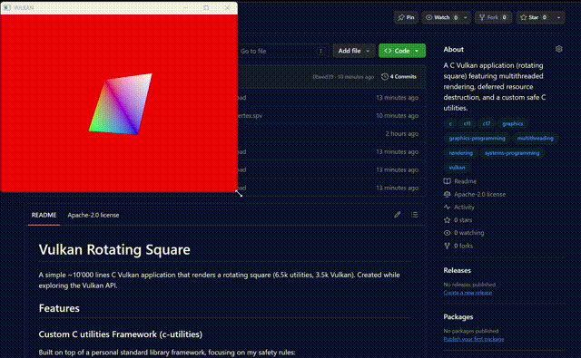

# Vulkan Square Rotation

A simple ~10'000 lines C Vulkan application that renders a rotating square (6.5k utilities, 3.5k Vulkan). Created while exploring the Vulkan API.

# Demonstration


## Features
### Custom C utilities Framework (c-utilities)
Built on top of a personal standard library framework, focusing on my safety rules:

- **Overflow-safe mathematics** - Preventing undefined behavior during memory size calculations.
- **Cross-platform file I/O** - Robust file reading utility with UTF-8 path support, Windows long path handling, and safe memory bound checks for reliably loading SPIR-V shaders on almost any OS.
- **Safe memory allocators** - Array-bound checking allocators and portable aligned memory allocators ensuring Vulkan's strict memory requirements are met without vulnerabilities.
- **Custom assertions and cleanup** - Formatted assertions (`assert_mf`) and `atexit`-based cleanup wrappers guarantee leak-free termination even on fatal errors.

**[c-utilities on GitHub](https://github.com/EleisonScel/c-utilities)**

### Multithreaded rendering
The main event loop and the rendering loop are decoupled. Render commands are executed on a dedicated thread with mutex and condition variable synchronization, pausing automatically when the window is minimized so as not to burn the CPU/GPU cycles.

### Deferred resource destruction
Implements a custom static ring-buffer-based deletion queue. Old swapchains, image views, and framebuffers are safely deferred for deletion until they are no longer used by the GPU, preventing synchronization errors. 

### Advanced Memory Management
- Implements a custom memory type selection algorithm that prioritizes device-local memory and intelligently falls back based on hardware heaps.
- Uses persistently mapped uniform buffers with strict alignment calculations and manual `vkFlushMappedMemoryRanges` for efficient CPU-to-GPU data transfer without unmapping overhead.

### Asynchronous Data Transfer

Detects and utilizes a dedicated transfer queue family, if it's available, for uploading vertex and index buffers via staging buffers, keeping the graphics queue free for rendering.

### Robustness and error recovery

Automatically handles catastrophic states like device or surface loss by attempting to recreate the logical device and surface on the fly without crashing or leaking memory.

### Efficient view update

View and projection matrices are cached and recomputed only when the window is resized or the projection is marked dirty, avoiding per-frame matrix recalculation.

### Imageless framebuffer and present fences usage

Uses `VK_KHR_imageless_framebuffer` for reduced memory overhead and faster framebuffer creation; `VK_EXT_swapchain_maintenance1` for proper seamless swap chain recreation and present scaling.

### Debug tooling

Integrates `VK_EXT_debug_utils` with validation layers to provide detailed runtime error reporting and performance warnings in debug build.

## Requirements
- c-utilities (custom safe C libraries: safe math, safe memory allocation, aligned memory, file I/O, etc.)
- Vulkan-enabled GPU and driver (no MacOS support, `VK_KHR_PORTABILITY_ENUMERATION_EXTENSION_NAME` would be needed; if you have MacOS to test, contact me on [EleisonNox@proton.me](mailto:EleisonNox@proton.me))
- GCC compiler
- C11 or C17 standard support
- `make` utility
- Libraries:
	- GLFW
	- cglm (C linear algebra)
	- pthread
	- Vulkan (includes `glslc` shader compiler)

## Build
At the top of the Makefile, set the variables to match your environment:

```make
PATH_TOOLCHAIN	= Path/to/the/toolchain
PATH_VULKAN		= Path/to/VulkanSDK
```

Then build with:
```bash
make		# release build
make debug	# debug build with validation layers
```
---

**License**: [Apache-2.0 license](LICENSE)
